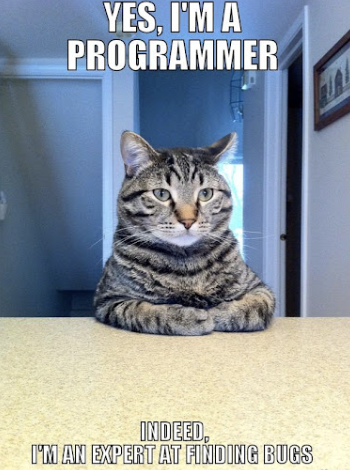

# Charlotte Dong's User Page

## Something about me
**Hello, world!** I'm a third-year Computer Engineering student at UCSD where ~~my code is cleaner than my room and~~ my ideas are as charged as my laptop—*always 100%*. I live by the creed **"eat, sleep, code, repeat,"** with a sprinkle of chaos to keep things interesting. I believe in making code not just work, but dance. Less bugs, more fun!




## Random Markdown Tryouts 
> Debugging is like being the detective in a crime movie where you are also the murderer.

```
hello world
```

[more swe memes](https://medium.com/fasal-engineering/funniest-software-development-memes-ever-f383ccf32a39)


[Link to the Section Title](#Random Markdown Tryouts)


[Relative link to lab1 screenshot](https://github.com/charl0ttedqy/CSE110/blob/main/lab1-screenshots/lab1-ss1.png)


- George Washington
* John Adams
+ Thomas Jefferson


1. James Madison
2. James Monroe
3. John Quincy Adams


- [x] C
- [ ] C++
- [ ] java
- [ ] python


